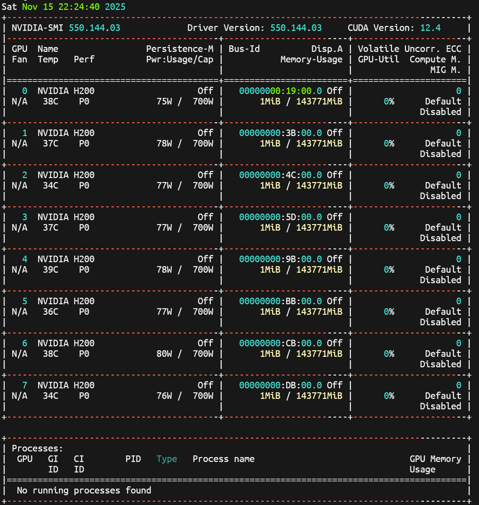
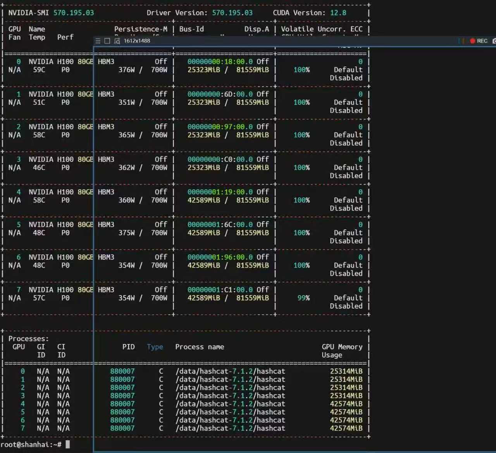
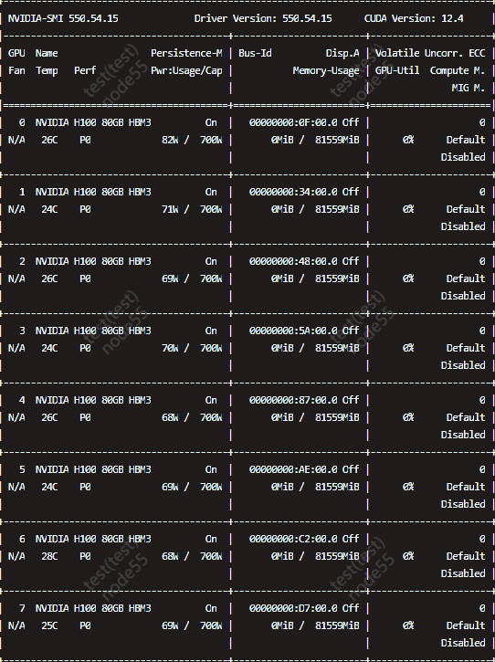
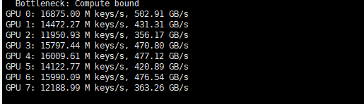
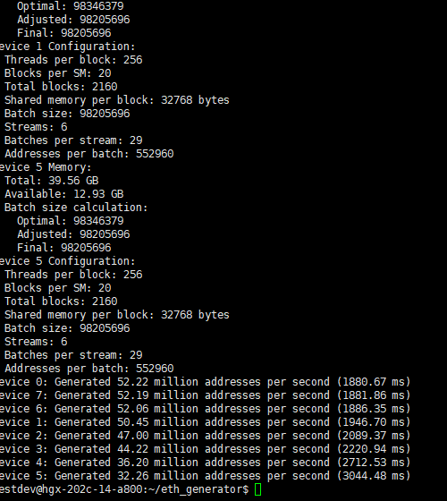

# 🛡️ Wallet Recovery Assistant

> 数字资产安全与恢复助手 · H100 / H200 GPU 算力集群 · 多算法恢复引擎 · 链上资产路径分析 · 钱包安全顾问服务

## 🚀 项目简介

Wallet Recovery Assistant 是一个面向数字资产安全与钱包恢复场景打造的专业技术服务项目。

我们专注于：

- 🔐 钱包助记词遗失后的恢复路径分析
- 🧠 多算法钱包线索推演
- ⚡ H100 / H200 高性能 GPU 算力辅助验证
- 🔎 链上资产路径排查
- 🧾 交易所冻结、风控、KYC 申诉材料整理
- 🛡️ 数字资产安全加固与风险隔离

我们不是普通的“钱包咨询服务”，而是围绕 **算力、算法、链上数据、安全流程、恢复经验** 打造的一套数字资产安全恢复体系。

## 🖼️ 算力与技术展示

### H200 GPU Cluster

### H100 GPU Running Cluster

### H100 80GB HBM3 Cluster

### GPU Benchmark

### Address Generation Engine

## ⚡ 高性能算力集群

我们具备 H100 / H200 级别 GPU 算力资源，可用于授权场景下的钱包恢复计算、候选路径验证、地址匹配和大规模数据分析。

核心优势：

- 🚀 NVIDIA H100 / H200 高性能算力支持
- 🧮 GPU 并行计算能力
- 🧠 多模型、多算法并行验证
- 🔍 大规模候选空间筛选
- 📊 高吞吐地址生成与匹配能力
- 🧾 全流程可审计、可记录、可复盘

> 所有恢复分析仅限用户本人授权资产，不支持任何未授权破解、盗取、绕过或非法访问行为。

## 🧠 多算法恢复引擎

系统围绕钱包恢复场景设计了多种算法思路，用于提升线索整理、候选验证和恢复路径判断效率。

### 1. 助记词结构分析

- BIP39 助记词格式检查
- 助记词长度识别
- 单词拼写错误识别
- 相似词候选匹配
- 缺词、错词、顺序异常分析
- 校验位一致性验证

### 2. 钱包派生路径分析

支持常见钱包路径分析：

- Ethereum
- Bitcoin
- BNB Chain
- Tron
- Polygon
- Arbitrum
- Optimism
- Solana
- 多账户、多地址索引扫描

用于判断：

- 用户是否选错钱包路径
- 是否导入了正确助记词但显示地址不一致
- 是否存在隐藏账户或历史地址
- 是否是链网络选择错误导致资产不可见

### 3. 地址匹配与资产识别

- 地址候选批量生成
- 链上地址匹配
- 历史交易记录比对
- 多链资产状态识别
- 合约地址识别
- 交易所充值地址判断
- 跨链桥路径辅助分析

### 4. 密码与线索组合分析

适用于用户仍持有加密文件、旧设备、密码线索或部分记忆的情况。

支持分析方向：

- 密码规则整理
- 常见变体组合
- 时间、生日、邮箱、昵称等线索结构化
- 用户自定义规则组合
- 授权环境下的候选验证

### 5. 链上行为与证据分析

- 交易哈希分析
- 资金流向追踪
- 代币合约识别
- 错链转账判断
- 交易所入金路径分析
- 申诉材料辅助整理

## 🔐 核心服务

### 1. 钱包恢复资料整理

适用于：

- 助记词遗失
- 助记词顺序错误
- 助记词单词记错
- 钱包密码遗忘
- 手机、电脑、硬件钱包损坏
- 钱包 App 卸载或数据丢失
- 浏览器插件钱包异常

服务内容：

- 梳理钱包类型、创建时间、设备状态
- 排查可能存在的备份线索
- 分析恢复可行性
- 提供安全恢复流程建议
- 避免用户误把助记词导入可疑工具

### 2. 链上资产路径排查

适用于：

- 转错链
- 转错地址
- 跨链桥异常
- 合约交互失败
- 资产显示异常
- 交易所充值未到账

服务内容：

- 根据公开地址和交易哈希分析资产状态
- 整理链上交易时间线
- 判断资产是否仍可由用户控制
- 判断是否需要交易所或平台介入
- 准备官方申诉所需材料

### 3. 交易所账户申诉支持

适用于：

- 账户冻结
- KYC 审核失败
- 风控限制提现
- 充值未到账
- 误充错链或错币种

服务内容：

- 整理官方申诉材料
- 生成问题描述模板
- 梳理资金来源说明
- 提高沟通效率和材料完整度

## 🛡️ 安全边界

我们坚持安全、合规、授权原则。

我们不会做：

- ❌ 不索要完整助记词
- ❌ 不索要私钥
- ❌ 不索要验证码
- ❌ 不破解他人钱包或账户
- ❌ 不绕过交易所、钱包厂商或监管要求
- ❌ 不承诺一定找回资产
- ❌ 不代用户保管资产
- ❌ 不要求用户转账验证身份

用户必须注意：

- ⚠️ 任何索要助记词或私钥的人都是高风险对象
- ⚠️ 不要安装陌生人发送的钱包插件或恢复工具
- ⚠️ 不要通过非官方渠道处理交易所账户问题
- ⚠️ 如果怀疑助记词泄露，应优先转移仍可控制资产

## 🧩 建议业务流程

1. 初步咨询  
   用户描述问题类型，但不提供助记词、私钥、验证码。

2. 风险隔离  
   停止在可疑设备继续操作，保护仍可控制资产。

3. 资料收集  
   仅收集公开地址、交易哈希、钱包类型、设备状态、官方邮件截图等非敏感信息。

4. 技术分析  
   基于钱包类型、链上记录、设备状态、备份线索和算法模型进行恢复路径判断。

5. 算力验证  
   在用户授权范围内，使用 GPU 算力和多算法引擎进行候选验证与地址匹配。

6. 输出建议  
   提供恢复路径、材料清单、风险提示和下一步操作方案。

## 📌 可公开提交的信息

可以提交：

- 钱包类型
- 公链名称
- 公开钱包地址
- 交易哈希
- 交易时间
- 交易所名称
- 错误提示截图
- 设备型号和损坏情况
- 部分非敏感线索描述

禁止提交：

- 助记词
- 私钥
- Keystore 密码
- 交易所密码
- 短信验证码
- 邮箱验证码
- 身份证完整照片
- 银行卡完整信息

## 📞 联系方式

如需咨询数字资产安全、钱包恢复、链上资产排查或交易所申诉材料整理，可通过以下官方渠道联系：

- Telegram: [https://t.me/eth88888eth](https://t.me/eth88888eth)

> 安全提醒：沟通过程中请勿发送助记词、私钥、Keystore 密码、验证码、交易所登录密码或任何可直接控制资产的信息。

## 🔥 技术亮点

- ⚡ H100 / H200 高性能 GPU 算力集群
- 🧠 多算法候选验证引擎
- 🔐 BIP39 / BIP44 / 多链路径分析
- 🌐 多链资产识别
- 📊 地址批量生成与匹配
- 🧾 交易所申诉材料辅助
- 🛡️ 安全边界优先
- 🔎 全流程可追踪、可复盘

## 🚀 后续规划

- 增加本地风险评估表单
- 增加链上资产排查清单
- 增加交易所申诉材料模板
- 增加客户安全教育文档
- 增加常见钱包路径数据库
- 增加多链地址识别工具
- 增加恢复可行性评分模型
- 增加安全顾问工作流

## ⚠️ 免责声明

本项目提供的是数字资产安全、资料整理、链上分析和恢复路径建议，不构成法律、投资或财务建议。

数字资产恢复存在不确定性，任何找回结果都取决于钱包类型、备份情况、链上状态、平台规则、用户授权范围和信息完整度。

本项目不支持任何未授权访问、破解他人钱包、盗取资产、绕过平台规则或违法违规行为。
